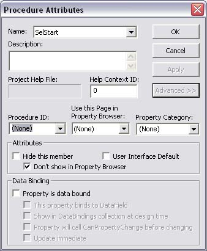



## Make UserControl Runtime\-only properties

### Description

Teaches you how to make runtime-only properties
 
### More Info
 

             |
---                |---
**Submitted On**   |
**By**             |[Ryan F](https://github.com/Planet-Source-Code/PSCIndex/blob/master/ByAuthor/ryan-f.md)
**Level**          |Beginner
**User Rating**    |5.0 (15 globes from 3 users)
**Compatibility**  |VB 5\.0, VB 6\.0
**Category**       |[Custom Controls/ Forms/  Menus](https://github.com/Planet-Source-Code/PSCIndex/blob/master/ByCategory/custom-controls-forms-menus__1-4.md)
**World**          |[Visual Basic](https://github.com/Planet-Source-Code/PSCIndex/blob/master/ByWorld/visual-basic.md)
**Archive File**   |

### Source Code

Declare the property (<TT>Tools-Add Procedure</TT>) then click <TT>Tools-Procedure Attributes</TT>. Click "Advanced" then select "Don't show in Property Browser". Click OK then you're done!

